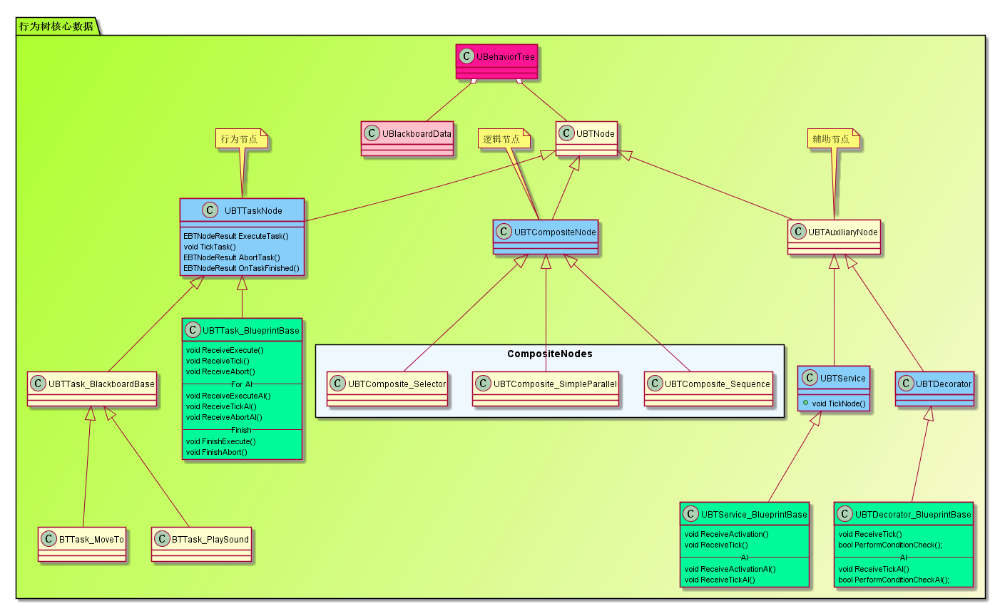
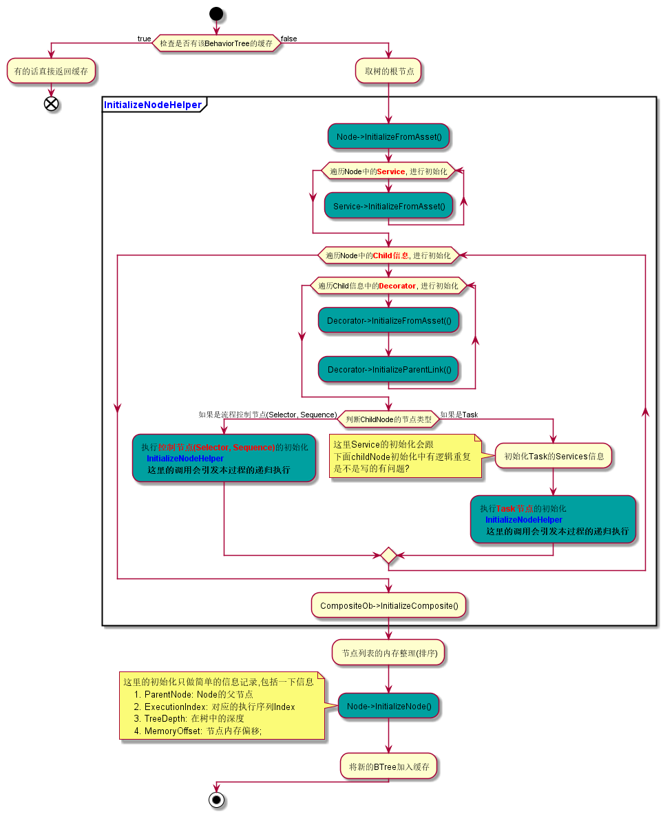
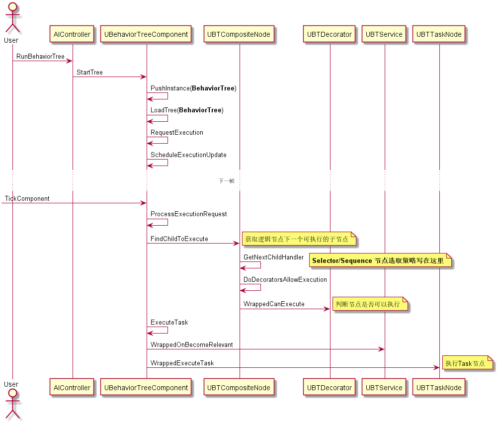

UE4的AI系统
===============

## BehaviorTree体系
### 行为树简述
* 行为树的基本组成
    + 根节点, 行为树执行入口
    + 逻辑节点  
        + Selector  
            依次执行子节点只要有一个执行成功就返回父节点
        + Sequence
            遍历执行所以子节点直到有一个执行失败则返回父节点
    + 行为节点  
        叶节点，行为逻辑所在处
    + 条件控制器  
        用来决定节点是否符合执行条件
* UE4 行为树特点  
    + 标准行为树是Tick驱动的，UE4的行为树是事件驱动的，上一个节点的完成事件才会触发下一次执行节点的搜索
    + 单独抽离的数据层 —— BlackBoard
    + 辅助节点的概念  
        UE4定义了两种辅助节点, 辅助节点可以附着在任意节点上进行装饰
        + Decorator  
            用来实现节点执行条件控制
        + Service  
            用来为节点添加额外执行逻辑(Background), Service节点没有执行返回值，也不会影响行为树的节点执行流
### 行为树的核心数据结构
* 基础类结构
    + 
* `BehaviorTree`  
    行为树对象，包含两部分内容
    1. 行为树对应的数据(`UBlackboardData`)
    2. 节点执行树(`UBTCompositeNode`)
* `UBTNode`  
    <b>行为树节点，所有能在编辑器摆放拖动的都是该节点的子类的对象 </b>  
    该类几个成员变量
    + `UBTCompositeNode* ParentNode`  
        父逻辑节点
    + `uint16 ExecutionIndex`
    + `uint8 TreeDepth`

* `UBTCompositeNode`  
    逻辑节点父类， 派生出`BTComposite_Selector`和`BTComposite_Sequence`这两个在实际行为树中控制执行逻辑的节点， 包含以下几个数据
    + <a href="#id_FBTCompositedChild">子节点</a>
        > `TArray <FBTCompositedChild> Children`  
        <b>只有逻辑节点才有子节点</b>
    + 附着在本节点的Service
        > `TArray<UBTService*> Services`

    节点包含的行为
    + 节点执行
        > `void ConditionalNotifyChildExecution(UBehaviorTreeComponent&, uint8*, const UBTNode&, EBTNodeResult::Type& ) const;`  
        注意节点的执行是有结果的 —— 成功 or 失败 or 其他
    + `Activation` / `Deactivation`
        > `Activation` / `Deactivation` 表示行为树的下一个执行节点的搜索过程搜索到了该节点，与节点是否执行并无必然关系

* <a id="id_FBTCompositedChild">`FBTCompositedChild`</a>  
    该结构体封装了一个节点的子节点信息, 通过递归访问 `ChildComposite/ChildTask` 可以得到整颗行为树的执行流
    + `UBTCompositeNode* ChildComposite` 如果子节点是逻辑节点, 这里指向逻辑节点
    + `UBTTaskNode* ChildTask` 如果子节点是行为节点, 这里指向行为节点
    + `TArray<UBTDecorator*> Decorators` 子节点的执行条件

* `UBTAuxiliaryNode`  
    辅助节点, 主要派生出Service节点 和 Decorator节点
    + 逻辑节点 —— `UBTService`
        > `void TickNode(UBehaviorTreeComponent& OwnerComp, uint8* NodeMemory, float DeltaSeconds)`
    + 条件节点 —— `UBTDecorator`
        > `bool CalculateRawConditionValue(UBehaviorTreeComponent& , uint8*)`

* `UBTTaskNode`  
    行为节点
    > `EBTNodeResult::Type ExecuteTask(UBehaviorTreeComponent&, uint8*)`  
    > `EBTNodeResult::Type AbortTask(UBehaviorTreeComponent&, uint8*)`  
    > `void TickTask(UBehaviorTreeComponent&, uint8*, float DeltaSeconds)`
### `UBehaviorTreeComponent`
* `FBehaviorTreeInstance` & `FBehaviorTreeInstanceId`  
        这两个结构都保存的是BehaviorTree执行时信息  
        我们需要想象我们是在处理一颗由多个子树组成的复杂行为树
    * `FBehaviorTreeInstance`
        - ::`RootNode`
            根节点
        - ::`ActiveNode`
            正在执行的节点
        - ::`ActiveAuxNodes`
            辅助节点(Service|Decorator)
        - ::`InstanceIdIndex`
            对应的`FBehaviorTreeInstanceId`
    * `FBehaviorTreeInstanceId`
        - ::`TreeAsset`  
            对应的行为树资源对象 `UBehaviorTree`
        - ::`Path`  
            从最顶层行为树的RootNode执行到当前树的Node `ExecutionIndex`列表
            该变量表示的是执行到本行为树的节点执行路径
* BehaviorTree加载
    + 
* BehaviorTree基础执行流
    + 

### 注意几点:
* Root所连得节点是实际的根节点，且该节点必须是控制节点
* 根控制节点上的`Decorator`上不会起作用

## BehaviorTree Editor相关
### UEdGraphSchema_BehaviorTree

## BehaviorTree帧同步改造方案
BehaviorTree体系中涉及的浮点计算并不多，主要在于Tick中会有一些对于DeltaTime的浮点运算。改造主要在BehaviorTree数据结构 和 执行流的驱动这两个方面
### BehaviorTree数据结构的改造
数据结构的改造其实就是对行为树中Node的修改，以下对三类Node分别进行说明
* `UBTCompositeNode`
> 这类Node都是逻辑节点(`Selector/Sequence`), <strong>没有`Tick`</strong>, 也不涉及浮点计算，不需要动
* `UBTAuxiliaryNode`
> 这里的改造在两点  
> 1. 这类节点有`Tick`
> 2. 辅助节点里有控制Tick间隔的机制, 会有浮点计算(ps. 这个机制基本上就给`BTService`用, 然而机制写在了`FBTAuxiliaryNode`, 估计是想着之后对辅助节点的扩展会用到这个机制优化吧)  
>
> 由于UE4的`BehaviorTree`的逻辑中会有大量对`BTService`和`BTDecorate`的直接引用，如果我们直接对`FBTAuxiliaryNode`进行继承修改那么势必会需要重写`BTService`和`BTDecorate`,那么原始逻辑中对这两个类的使用都会出现不兼容问题(虽然通过控制内存排列和`reinterpret_cast`也能做到，代码会比较冗余和难看), 这里选择以下做法: 
1. 抽象出一个`LSBTNode`的接口, 接口只提供`Tick`的功能
> `void LSTick(UBehaviorTreeComponent& OwnerComp, uint8* NodeMemory, FP DeltaSeconds)`
> `void LSWrappedTick(UBehaviorTreeComponent& OwnerComp, uint8* NodeMemory, FP DeltaSeconds)`
2. 分别从`BTService` 和 `BTDecorate`派生出实现这个接口的`LS`版本子类来接入`Tick`的逻辑, 作为帧同步辅助节点的基础父类
3. 将引擎中`_BlueprintBase`系的代码拷贝出来重新继承上面的`LS`版本基础父类，蓝图中的自定义节点皆从此类派生
* `ULSBTTaskNode`
    改造方案同`UBTAuxiliaryNode`

### BehaviorTree驱动组件的改造
* `LSUBehaviorTreeComponent` 继承自 `BehaviorTreeComponent`, 并增加`::LSTickComponent()`方法，帧同步框架调用这个`Tick`函数即可
