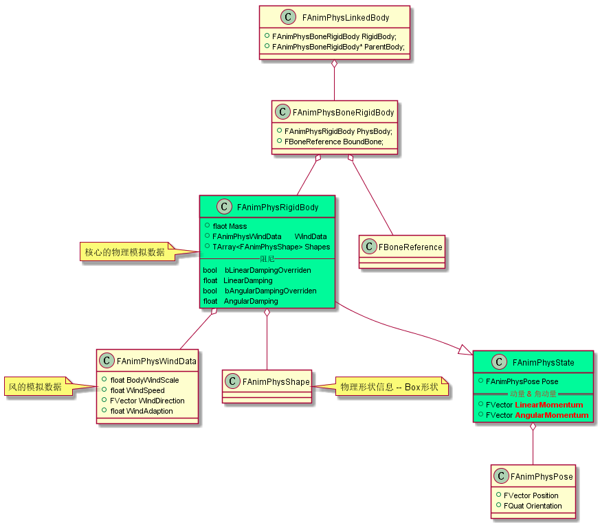
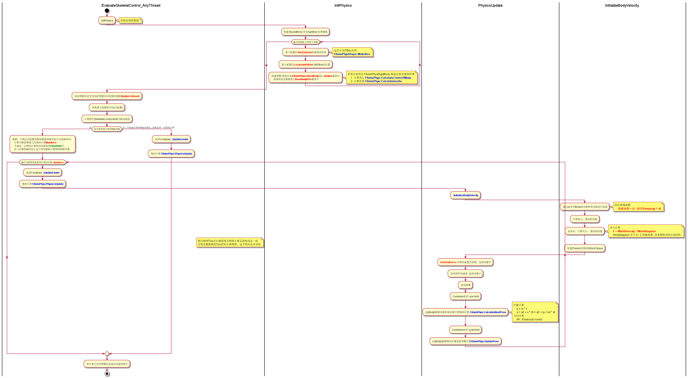
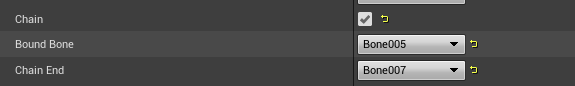
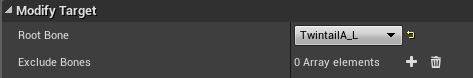
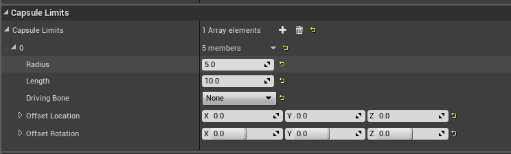
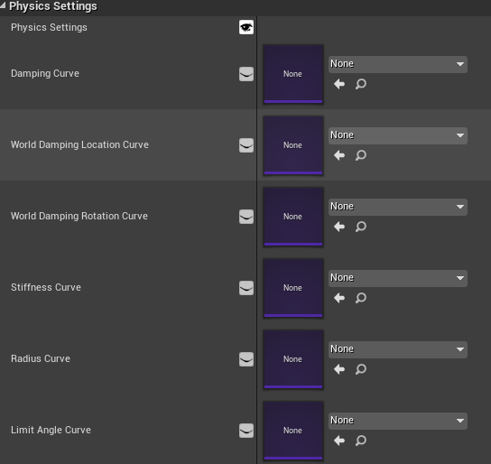
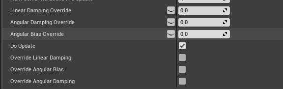

Dynamic Animation的物理模拟
==============

## 物理数据的类型结构
  

## 物理模拟过程
### 相关物理公式
* 加速度
    > F = m * acc  
    > 重力加速度: F = m * g 
* 动量
    > p = m * v  
    > p1 - p0 =  F * dt = m * acc * dt 
* 动量与位置
    > s = s0 + v * dt = s0 + (p / m) * dt
* 简谐运动回复力
    > f = k * x
### 计算过程
  

* 骨骼位置物理模拟
    这里的核心是计算当前动量
    1. 动量衰减
        * 阻尼衰减系数: `DampingOver = ( 1 - Damping) ^ dt`
        * 计算动量 `Momentum *=  DampingOver`
    2. 重力计算
        * 重力 `Gravity = g * Mass`
        * 计算动量 `Momentum += Gravity * dt`
    3. 风
        * 风力模拟 `WindForce = WindVel * WindAdaption`  
            注意 `WindAdaption` 是0-2的随机浮点数  
        * 计算动量 `Momentum += WindForce * dt`
    4. 程序动态指定的`ExternalForce`
        * 计算动量 `Momentum += ExternalForce * dt`
    5. Skeletal组件牵引模拟  
        在Anim系统(非World空间)下进行的任何变换，都是基于组件空间的局部变换，最终都会随Skeletal组件进行统一的空间变换，所以如果不进行处理的情况下，我们的骨骼会随着组件进行一致性的运动，不符合物理真实  
        所以我们需要计算出一个反向力来抵消掉Skeletal组件移动产生的影响  
        对于Skeletal组件的牵引效果有两方面，首先是Skeletal移动的牵引效果, 类似普通的拖拽, 其次是Skeletal加速时的牵引效果  
        `AnimDynamic`将这两方面的效果统一到一个加速度中，最终由这个加速度换算成力
        - 组件拖拽 `ComponentAcc = ComponentVel * VelScale`
        - 组件加速度 `ComponentAcc += ComponentAcc * AccScale`
        - 计算动量 `Momentum += ComponentAcc * Mass * dt`
    5. 父骨骼牵引
        在骨骼链上前后两个骨骼构建弹性牵引关系
        * 弹簧回复力: 
            > `f = SpringConstantLinear * SpringLength`  
            or  
            > `f = -SpringConstantLinear * SpringLength`  

            `SpringConstantLinear` : 弹性系数  
            `SpringLength` : 骨骼间距  
        * 计算动量: `Momentum += f * dt `
    6. 计算位移
        * `Location = PrevLocation + (Momentum / Mass) * dt`
* 骨骼旋转物理模拟

## `KawaiiPhysics`
### 物理模拟过程
* `KawaiiPhysics` 物理计算过程
    * 骨骼位置的物理模拟
        1. 速度  
            - 当帧速度 `v = (Location - PrevLocation) / dt_old`
            - 阻尼衰减 `v = v * (1 - Damping)`
            - 位置累加 `Location += v * dt`
        2. 风
            - 风的助推速度 `v = WindV * WindAdaption * FrameRate`  
              注意 `WindAdaption` 跟`AnimDynamic`一致, 是0-2的随机浮点数  
              <strong>不太明白的是这里为什么要乘以帧率(他默认是固定60)</strong>
            - 位置累加 `Location += v * dt`
        3. Skeletal组件牵引模拟
            - 先计算组件的相对位移量  
                `SkelCompMoveVel = CompTransform.InverseTransformPosition(PreCompTransform)`  
                这个位移量即是相对于组件反方向位移量
            - 位移量进行阻尼衰减 `dLoc = SkelCompMoveVel * (1 - WorldDamping)`
            - 位置累加 `Location += dLoc`
        4. 重力计算  
            用基础重力加速度公式即可
            - 位置累加 `Location += 0.5 * g * dt * dt`
        5. 父骨骼牵引  
            这里是一个简单的弹簧模拟，有一个弹性系数`Stiffness`，用来描述类似父骨骼到子骨骼的连线多硬或多软这样的概念  
            如果该系数是1, 那么父子骨骼之间是刚体链接，保持固定间距
            - 位置计算 `Location += (dLoc + ParentLocation - Location) * ( 1 - (1 - stiffness) ^ Exp )`  
            `dLoc` 表示 父子骨骼之间开始的位移距离  
            `Exp` 是一个跟时间有关的函数，f(x) = a * dt  (a是固定系数, 在这个算法里 a = frameRate)
        6. 保证骨骼一致性(骨骼不拉伸)  
            以上物理计算结果只作为骨骼的运动趋势，用来最终确定实际骨骼位置
            - `dir = (Location - ParentLocation).Normal()`
            - 位置计算 `Location = dir * BoneLength + ParentLocation`
    * 骨骼旋转的物理模拟  
        <strong>`KawaiiPhysic`不做旋转的模拟</strong>

## `AnimDynamic` <i>vs</i> `KawaiiPhysics`
1. `AnimDynamic`基于动量守恒的思想，有力的概念，参数化的`Force`可以通过外部调节力来控制物理效果 
    `KawaiiPhysics`没有力的概念
2. `AnimDynamic` 只能支持骨骼链
    

    `KawaiiPhysics`支持骨骼树  
    

3. `AnimDynamic`有Rotation的物理模拟  
    `KawaiiPhysics`没有Rotation的物理模拟

4. `KawaiiPhysics`新增了`Capsule`形状的物理限制
    

5. `KawaiiPhysics`对阻尼的支持更好，提供了更为丰富的阻尼参数，并且可以设定曲线, 这个曲线是基于骨骼深度的，即可以为每个骨骼节点单独设定阻尼  
    
    
    `AnimDynamic`只能设置统一的阻尼值
    
