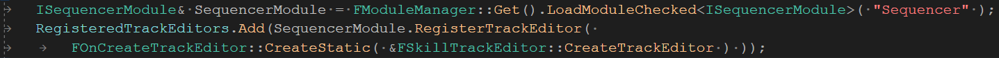
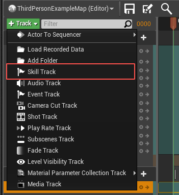
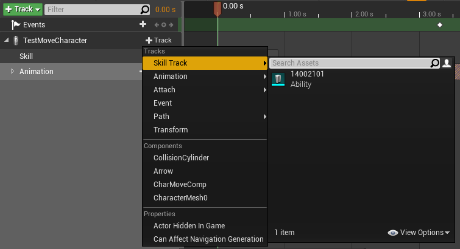
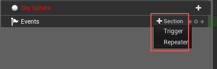
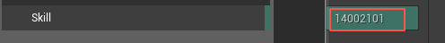
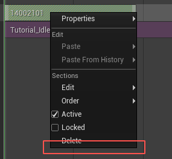
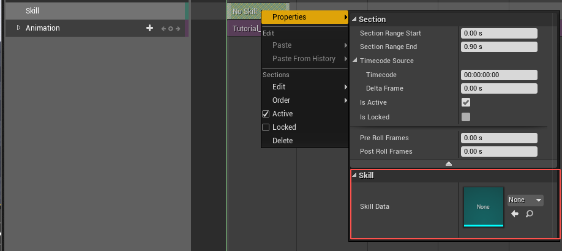
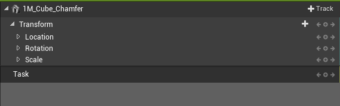
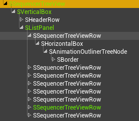

UE4的LevelSequence
==============

## `Sequence`基础结构
* `MovieScene` <i>vs</i> `MovieSceneSequence`
    > `MovieScene`中存储了制作的动画数据  
    > `MovieSceneSequence`是`MovieScene`的外层控制类

    `LevelSequence`、`ActorSequence`都派生于`MovieSceneSequence`

* `MovieScene`构成
    * `Track` -- `UMovieSceneTrack`
        `Track`可以理解成可以随着`Timeline`进行动画的数据集  
        `Track`的长度跟`Timeline`一致
    * `Section` -- `UMovieSceneSection`  
        一个`Track`中可以有复数个`Section`  
        `Section`中有具体的动画数据， 可以加关键帧
        `Section`可以占据整条`Timeline`, 也可以是一条`Timeline`中的一部分
    * `Channel` --  `FMovieSceneChannel`
        一个`Section`对应一个`Channel`,`Channel`中保存`Section`中的关键帧数据
    * `Template` -- `FMovieSceneEvalTemplateBase`
        `Template`用于动画计算

## 自定义`SkillTrack`过程
### `FSkillTrackEditor`

    继承自 `FMovieSceneTrackEditor`
1. 在编辑器上注册新的Track
    
2. 提供`LevelSequence`编辑器上`Track`的增加入口
    * `::BuildAddTrackMenu()`  
        
    * `::BuildObjectBindingTrackMenu()`  
        
    * `::BuildOutlinerEditWidget()`
        
    
    可以在这两个`Menu`里增加`AddTrack`的逻辑
3. 添加`Track`
    > `FMovieSceneTrackEditor::AddTrack()`  
    通过这个函数的调用可以往`MovieScene`的`Binding`下加一条`Track`
    `Track`的颜色通过`XXXXTrack::TrackTint`这个变量设置
4. 给`Track`添加`Section`
    > `UMovieSceneTrack::AddSection(newSection)`  
5. 自定义`Section` UI表现形式
    * 先重载 `Section Interface` 的方法
        > `FMovieSceneTrackEditor::MakeSectionInterface()`
    * 新增类 `FSkillSectionInterface`
        > 继承接口 `ISequencerSection`

        几个常用的方法:
        * `::GetSectionTitle()` 显示名字  
             
        * `::GetSectionHeight()` 高度
        * `::GetContentPadding()` Padding
        * `::OnPaintSection()`  
            这里允许你在引擎本身的UI之上绘制其他东西，基于Slate的接口，写起来有点复杂
        * `::BuildSectionContextMenu()`
            在`Section`上点击右键出现的菜单中加选项  
             

### `UMovieSceneSkillTrack`

    `MovieScene Track`的实体类
    继承自 `UMovieSceneTrack`

* 必须实现的`Pure Virtual`方法  
    这些方法基本都是围绕`Track`上`Section`相关信息和行为
    1. `::SupportsType()`  
        定义`Track`上`Section`的类
    2. `::CreateNewSection()`  
        实例化一个`Section`对象
    3. `::AddSection()`  
        将一个`Section`对象添加到`Track`上
    4. `::RemoveSection()`
        从`Track`上移除一个`Section`对象
    5. `::HasSection()`
        `Track`是否包含某个`Track`对象
    6. `::IsEmpty()`
        `Track`是否包含`Section`

### `UMovieSceneSkillSection`

    `Track`上`Section`对象

* 该类的`UPROPERTY`成员会现实在`Section`右键菜单的属性面板里  
    

* 设置用于执行`MovieScene`计算的类
    > `::GenerateTemplate()`

### `UMovieSceneChannel`
    对应`Section`上的`key`的集合

1. `Traits`

### `FMovieSceneSkillSectionTemplate`
    这个类里有`Section`的帧计算
* 两种指定`Section`使用的`Template`的方法
    1. `UMovieSceneTrack::CreateTemplateForSection()` 中设置  
        这个可以用于当`Track`中有多`Section`时方便为不同`Section`使用不同的计算`Template`
    2. `UMovieSceneSection::GenerateTemplate()`中设置  
        设置本`Section`使用的用于计算的`Template`

* `Template`用于帧计算时的流程
    > `::Evaluate()`
    > `::Evaluate`

* `Actuator` 实际进行`MovieScene`动画计算的地方
    * 数据绑定
        两个容易漏掉的模板方法
        > template<> FMovieSceneAnimTypeID GetBlendingDataType<MovieScene::FSkillActuatorData>()  
        > {  
        >    static FMovieSceneAnimTypeID TypeID = FMovieSceneAnimTypeID::Unique();  
        >    return TypeID;  
        > }

        > void BlendValue(FSkillActuatorData& OutBlend, const FMinimalAnimParameters& InValue, float Weight, 
        > EMovieSceneBlendType BlendType, TMovieSceneInitialValueStore<FSkillActuatorData>& InitialValueStore)  
        > {  
        >   OutBlend.AllAnimations.Add(InValue);  
        > }

## 深入`Sequence`体系
### 主要涉及的模块 跟 代码结构
* `Runtime`的模块
    * `MovieScene`  
        这个模块是`Sequence`的核心部分, 定义了`Sequence`的组成结构和计算逻辑  
        另外该模块还提供了各个组成部分的一些基础支持，比如基础数据类型的`Channel`
    * `MovieSceneTracks`  
        这个模块包含了引擎所支持的所有内置`Track`的实现
    * `LevelSequence`  
        这个模块为`MovieScene`添加一些上层逻辑衍生出`LevelSequence`的概念
* `Editor`的模块
    * `MovieSceneTools`  
        这个模块主要包含引擎一系列`Track`的`TrackEditor`
    * `SequencerWidgets`  
        这个模块提供`Sequencer`编辑器基础组件
    * `Sequencer`  
        `Sequencer`主要编辑器模块  
        `Track`、`Section`、`Key`、`Node`等的编辑UI都在这里

* `Plugins`的模块  
    `Plugins`下的相关模块主要是基于`Sequence`进行上层逻辑形式的衍生, 目前版本派生出了两种`Sequence`

    > 从`Plugins`下模块能看出`UnrealEngine`这部分结构还处于调整跟重构中  
    > 目前`LevelSequence`的`Runtime`逻辑仍然放在`Source/Runtime`下，定制的`Editor`部分则在`Plugin`下  
    > 相应的`ActorSequence`的`Runtime`逻辑和`Editor`逻辑则都统一放在`Plugins`下  
    > 未来这部分上层逻辑层使用的东西应该都会在`Plugins`下统一组织, 引擎核心框架更加简洁，也更突出使用插件进行组织方式  

    * `ActorSequence`
        - `ActorSequence`  
            `Runtime`模块
        - `ActorSequenceEditor`  
            编辑器模块
    * `LevelSequenceEditor`  
        `LevelSequence`的编辑器  
        这里的编辑器模块区别于`Sequencer`的地方在于，本模块对实际`Sequence`的UI的定制很少，主要是外层逻辑的控制，比如`Actor Binding`, 播放控制等
    * `SequencerScripting`  
        这个模块提供了主要提供了对`Python`操作`Sequence`的支持, 提供了一些访问和操作`Sequence`的一些工具方法

### `Sequence`编辑器
* 编辑器窗口结构

    顶层控件: `SSequencer` 

    * 上方 `Toolbar`
        > `SSequencer::MakeToolbar()`

    * 左边`TreeView`

        控件: `SSequencerTreeView` 

    * 右边 上部 `Timeline`

        控件: `SSequencerTimeSlider`
        > `FSequencerWidgetsModule::CreateTimeSlider()`
    
    * 右边 下部 `Track Detail`  

        控件: `SSequencerTrackArea`
    
    * 下方 左部 `Play Controll`

        控件: `STransportControl`
        > `FSequencer::MakeTransportControls()`
    
    * 下方 右部 `Time Info`

        控件: `SSequencerTimeSlider`
        > `FSequencerWidgetsModule::CreateTimeSlider()`

        控件: `STimeRange`
        > `FSequencerWidgetsModule::CreateTimeRange()`

* `SSequencerTreeView`  

    
    

    每一行对应一个`SSequencerTreeViewRow`,   
    每个`Row`对应一个`SAnimationOutlinerTreeNode`
    * `SSequencerTreeViewRow`
    * `SAnimationOutlinerTreeNode`

* `SSequencerTrackArea`

    `TrackArea`会有多条Lane，对应每个`Track`
    > `SSequencerTreeView::OnGenerateRow()`

    注意上面方法，`TrackArea`和`TrackLane`都是由`TreeView`生成的

    * `SSequencerTrackLane`
        - 单条`TrackLane`下的显示会有两种情况  
            > `FSequencerDisplayNode::GenerateWidgetForSectionArea`
            1. `Object`的Lane  
                > `SSequencerObjectTrack`  

                这种Lane类似Head，只能看，没有什么操作，比较简单
            2. `Section`的Lane  
                > `SSequencerSectionAreaView`  

                一个`AreaView`下会有多个`Section`,对应`Section`的控件为
                > `SSequencerSection`
* `SSequencerSection`
    * `SSequencerSection::Construct()`  
        => `ISequencerSection::GenerateSectionWidget()`
    * `SSequencerSection::OnPaint()`  
        1. => `ISequencerSection::OnPaintSection()`
        2. => 画关键帧: `SSequencerSection::PaintKeys()`
    
    从上面看`SSequencerSection`的UI绘制内容不多，主要是依托于`ISequencerSection`这个可用于自定义UI的接口, 我们在上面自定义Track时实现过这个类来自定义UI

### `Sequence`运行时
* `Class`体系
    1. `MovieScene`系

    2. `Sequencce`系
    3. `Player`系
        * `IMovieScenePlayer`  
            `Player`的基础接口，实际的`Player`都需要实现这个接口  
            这里定义了`Player`一些基础行为:
            * `Object Binding`相关
                > `binding Object`  
                > `resolve binding`  
                > `found binding object`  
                > `binding`的一些事件和通知  
            * 播放控制
                > 保存、恢复动画状态  
                > 相机或者视口相关的播放行为控制(这方面行为比较简单)
            
        * `FMovieSceneEvaluationState`  
            `Player`的成员对象, 为`Player`提供`Sequence`播放时的一些数据控制功能  
            其中缓存了当前`Player`所控制的`Sequence`对象列表，每个`Sequence`对象都会分配一个`SequenceId`

        * `FMovieScenePreAnimatedState`  
            为`Player`提供`pre-animated`的数据状态控制
    4. `Sequence`计算相关
        * `FMovieSceneTimeController`  
            `Timeline`的控制
        * `FMovieSceneContext`  
            继承自 `FMovieSceneEvaluationRange`  
            播放过程中每次`Tick`都会产生一个Context用来给后续的计算提供集中的参数信息  
            这里比较重要的就是本次`Tick`所跨过的帧长度和帧方向

        * `FMovieSceneRootEvaluationTemplateInstance`
            每个`Player`都会有一个`RootEvalTemplate`, 控制着`Sequence`的动画计算  

        * `FMovieSceneEvaluationTemplate` vs `FMovieSceneEvalTemplate`

* `Object Binding`过程  
    `FMovieSceneObjectBindingID`
    `FMovieSceneBinding` vs `FMovieScenePossessable`
* 动画状态保存
* 播放过程
    * `Time`换算
    *