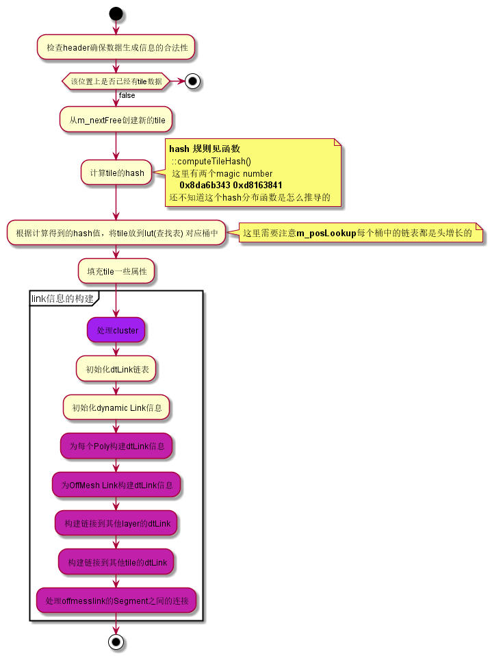
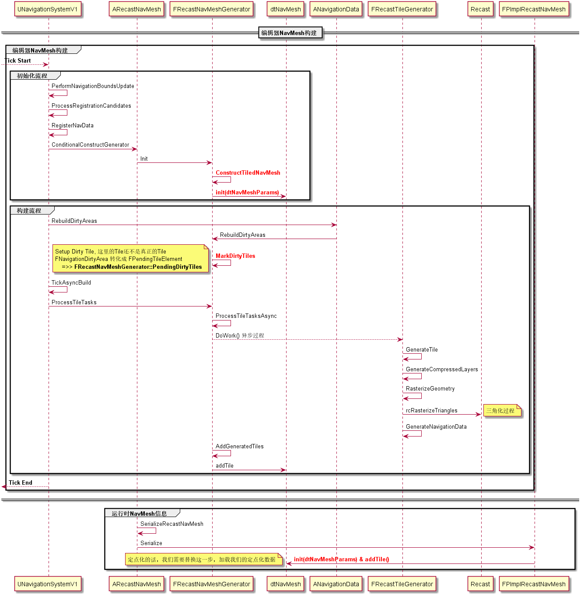
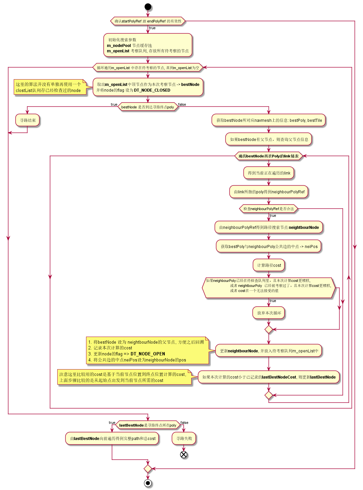
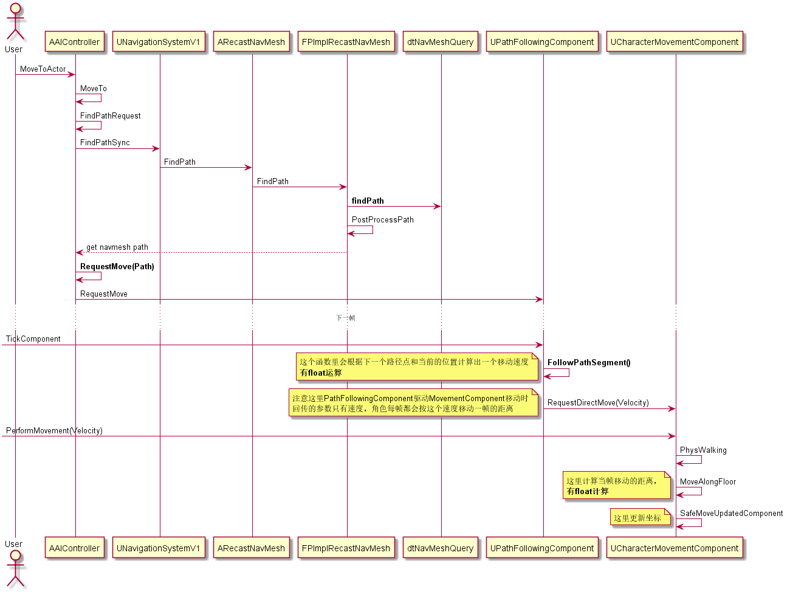

UE4导航与寻路网格
===============

## UE4 Navigation系统简介
### UE4的寻路系统主要基于开源的导航网格库recastnavigation
  * github 地址:  
    git@github.com:recastnavigation/recastnavigation.git
### 涉及到的几个Module
  - AIModule
    - `AIController`中有上层逻辑进行AI寻路的主要接口
        <code>
        - MoveTo
        - MoveToLocation
        - MoveToActor
        </code>
  - NavigationSystem  
    本Module主要处理以下几件事情  
    *  UE4到recastnavigation的一些概念跟数据流的转换  
        <code>
        - NavigationData
        - RecastNavMesh
        - NavArea
        - NavLink
        </code>
    * 基于recastnavigation的接口封装成可供UE4上层逻辑调用的寻路接口
        <code>
        - NavigationSystem(UNavigationSystemV1)
        - NavigationPath
        </code>
    * 导航网格数据的生成和更新
        <code>
        - RecastNavMeshGenerator
        </code>
    * 寻路debug信息以及相应的展示
  - Navmesh  
    集成在UE4内定制化过的recastnavigation库  
    NavMesh分为几个部分
    + Detour  
        负责 导航网格数据承载 和 寻路
        * `DetourNavMesh.h`  
        本文件基本定义了导航网格中所用到的所有数据结构，几个重要的概念
            - Poly - `dtPoly`
            - Tile - `dtMeshTile`
            - NavMesh - `dtNavMesh`
        * `DetourNavMeshQuery`  
        提供外部调用recastnavigation的接口
    + Recast  
        负责导航网格的生成, 体素化 三角化 等等

---------------------------

## 寻路信息的构建
### NavMesh参数
>#### rcConfig的填充
<ul>

当我们往场景中拖进一个`NavMeshBoundsVolume`时，会伴随中生成一个Actor:`ARecastNavMesh`, 我们可以在Detail面板更改`ARecastNavMesh`的属性，这些属性则定义了我们将会如何来生成我们的导航网格数据。而实际recastnavigation进行MavMesh的数据生成时，则需要转成其内部自定义数据`rcConfig`,以下展示了这过程中的一些数据映射  
> RecastNavMeshGenerator::ConfigureBuildProperties()

| rcConfig | ARecastNavMesh | 说明 |
| :----: | :----: | :----: 
| cs | CellSize | Cell 在 xz-plane 上的大小, 也就是<b>xz-plant上单个体素大小</b>
| ch | CellHeight | Cell 在y轴上的大小
| tileSize | TileSizeUU / CellSize | 单个Tile中Width/Height上Cell的数量, 所以一个Tile中Cell的数量是tileSize * tileSize(不考虑Border)
| walkableRadius | AgentRadius / CellSize | 这个值描述的是在距离原始阻挡几何范围之外还得有多大空间是不可导航到的，用来表现Agent的体积感
| borderSize | walkableRadius + 3 | 单位是Cell, Border的范围是不可导航的
| walkableSlopeAngle | AgentMaxSlope | 可行走的坡度, 范围(0, 90)
| walkableHeight | AgentHeight / CellHeight | Agent高度, Cell为单位
| walkableClimb | AgentMaxStepHeight / CellHeight | 可向上/下跨过的高度，比如梯子这种
| walkableRadius | AgentRadius / CellSize | Agent Radius
| AgentHeight | AgentHeight | Agent高度
| AgentMaxClimb | AgentMaxStepHeight |
| AgentRadius | AgentRadius | 该值越小，生成的NavMesh跟碰撞范围贴合的越紧
| minRegionArea | MinRegionArea / CellSize | 小于该Area大小的区域被认定为不可行走
| mergeRegionArea | MergeRegionSize / CellSize | 体素分割时小于该Area大小的区域可能被更大区域合并

</ul>

>#### dtNavMeshParams的填充
<ul>

`dtNavMeshParams`用来初始化`dtNavMesh`
> RecastNavMeshGenerator::ConfigureBuildProperties()

| dtNavMeshParams | rcConfig | 说明 |
| :----: | :----: | :----: 
| orig | ARecastNavMesh.NavMeshOriginOffset | NavMesh起始点偏移
| tileWidth | tileSize * cs | 单个Tile的宽度
| tileHeight | tileSize * cs | 这里应该是 * ch 才对，不知道是UE的bug
| maxTiles | - | 最大Tile数 (计算规则见下)
| maxPolys | - | 最大Poly数 (计算规则见下)

>

<strong>maxTiles & maxPolys</strong>  
1. 会计算有多少可用于存Tile数和poly数的bit  
    
<b>FRecastNavMeshGenerator::CalcPolyRefBits()</b>
    <code>
        
static const int32 TotalBits = (sizeof(dtPolyRef) * 8);

        
MaxTileBits = NavMeshOwner ? FMath::CeilToFloat(FMath::Log2(NavMeshOwner->GetTileNumberHardLimit())) : 20;

        
MaxPolyBits = FMath::Min<int32>(32, (TotalBits - DT_MIN_SALT_BITS) - MaxTileBits);

    </code>
    从上述代码可以看出  
        
 MaxTileBites 和 MaxPolyBits 被合并存在一个<code>dtPolyRef</code>变量内存上，从其定义可以看到该变量类型为uint64, 此外该变量还承载`DT_MIN_SALT_BITS`, 这三者公用这64个位

        
<code>ARecastNavMesh::TileNumberHardLimit</code>这个属性会指定最大的Tile数

    

2. MaxTiles & <code>ARecastNavMesh::bFixedTilePoolSize  </code>  

    * 如果是`FixedTilePoolSize`, 那么`maxTile` 则由`ARecastNavMesh::TilePoolSize`指定
    * 如果是Resizable TilePoolSize, 那么`maxTile` 则由config动态计算  
        <b><code>
            CaclulateMaxTilesCount()
        </code></b>  
    * 以上得到的MaxTile都不能溢出第一步中计算得出的, 可用于存储Tiles数的位

3. MaxPolys  
    最大Poly的计算相对简单  
    <code>
        MaxPolys = (MaxPolyBits >= 32) ? INT_MAX : (1 << MaxPolyBits);
    </code>

</ul>

### NavMesh数据构建
> #### `dtMeshTile`
> | 属性 | 类型 | 描述 | 
> | :----: | :----: | :----: |
> | header | <b>`dtMeshHeader`</b> | 关于tile的一些high level的信息, 比如 poly数, 顶点数, tile的x-y坐标(基于tile-grid的坐标) |
> | polys | <b>`dtPoly`</b> | tile中所有的poly |
> | verts | <b>`float`</b> | tile的verts |
> | detailMeshes | <b>`dtPolyDetail`</b> | detail-mesh => poly中的三角化信息 |
> | detailVerts | <b>`float`</b> | detail-mesh 的顶点数据 |
> | detailTris | <b>`char`</b> | detail-mesh的三角形数据 |
> | links | <b>`dtLinks`</b> | 表示poly间的连通性 |
> | offMeshCons | <b>`dtOffMeshConnection`</b> | Offmesh-Link的信息，比如 两个endPoint的顶点信息，感知半径和高度，所在poly等
> | offMeshSeg | <b>`dtOffMeshSegmentConnection`</b> | 拥有多Segmemt的Offmesh-Link信息 
> | dynamicLinksO | <b>`dtLink`</b> | offmesh 所连接的poly间的连通性 |
> | bvTree | <b>`dtBVNode`</b> | Bounding volume node |

> #### `dtPoly`
> | 属性 | 描述 | 
> | :----: | :----: |
> | firstLink | Link链表的头的Index, 数据指向dtLink, 用来表达poly间的联通性
> | verts | 顶点的index, 每个poly 最多6个顶点
> | neis | 相邻poly的ref
> | areaAndType | poly的type : DT_POLYTYPE_GROUND, DT_POLYTYPE_OFFMESH_POINT, DT_POLYTYPE_OFFMESH_SEGMENT

> #### `dtLink`  
>  每个poly的边都有一个指向相邻poly的link
>  本数据类型本身是一个链表的结点，所以带有next指针
> | 属性 | 类型 | 描述 | 
> | :----: | :----: | :----: |
> | ref | <b>`dtPolyRef`</b> | link指向的poly的ref
> | edge | <b>`char`</b> | link所在的poly的边
> | next | <b>`int`</b> | 指向所在链表的下一个元素

> #### `dtNavMesh`
> | 属性 | 类型 | 描述 | 
> | :----: | :----: | :----: |
> | m_orig | <b>`float`</b> | navmesh原点偏移量
> | m_maxTiles | <b>`int`</b> | tile的最大数目
> | m_tileLutSize | <b>`int`</b> | tile查找表的大小, `m_titleLutSize = dtNextPow2(maxTiles/4)`
> | m_tileLutMask | <b>`int`<b> | mask, 在tile hash的生成过程中限定hash在lut的index范围内
> | m_tiles | <b>`dtMeshTile*`</b> | tile的链表
> | m_posLookup | <b>`dtMeshTile*`</b> | tile查找表, 每个元素都是一个桶，里面存放tile的链表，这样可以在理论上达到存放任意数目的Tile

> #### `RecastNavMeshGenerator` & `RecastTileGeneratorTask`
> * 主要构建过程:  
>   1. <code> FRecastNavMeshGenerator::ProcessTileTasksAsync() </code>  
>   这个函数每帧都会触发，函数分为两个部分, 
>   第一部分根据`PendingDirtyTiles`来生成`FRecastTileGeneratorTask`异步处理单个Tile的生成(实际的Generate代码在`FRecastTileGenerator`中), 正在处理的Tile都会放入`RunningDirtyTiles`中。
>   第二部分是来探测Task是否完成，完成后更新`dtNavMesh`。
>   2. `FRecastTileGenerator::GenerateTile`  
>       * CompressdLayers <=> GeenrateCompressedLayers()
>       * NavigationData <=> GenerateNavigationData()
>           1. 体素化 (高度场)
>           2. 划分Tile
>           3. 生成Poly Mesh
>           4. 生成DetailedMesh, Poly的三角化  
>       注: 体素化 跟 三角化 的细节还没看完， 之后补充  
>   3. `FRecastTileGenerator::AddGeneratedTiles` & `FRecastTileGenerator::addTile`
>       将`FRecastTileGenerator`生成的tile数据更新到dtNavMesh中  
>       `FRecastTileGenerator::addTile`流程: 
>       * 
> * 生成过程相关的时序图
>       * 

## `Recast`解析
### 高度场信息
* `rcHeightField`
    > | 属性 | 类型 | 描述 | 
    > | :----: | :----: | :----: |
    > | width/height | int | 高度场二维长宽, 这里的<b>Height</b>并非三维空间的高度 |
    > | cs/ch | float | 体素大小 |
    > | spans | rcSpan* | <b> 高度场核心数据</b>, 数组，长度为 <b>width * height</b>|
    > | EdgeHit | rcEdgeHit* | <i>UE自定义数据</i> |
    > | RowExt | rcRowExt* | <i>UE自定义数据</i> |
    > | tempspans | rcTempSpan* | <i>UE自定义数据</i> |
* `rcHeightfieldLayer`
    > | 属性 | 类型 | 描述 | 
    > | :----: | :----: | :----: |
    > | cs/ch | float | 体素大小 |
    > | width | int | 高度场宽 |
    > | height | int | 高度场高 |
    > | heights | short* | 高度场数据 | 
    > | areas | char* | |
    > | cons | char* | |
### `Recast`函数解析
* `rcAllocHeightfield` 分配高度场对象内存
* `rcCreateHeightfield`  
    初始化`rcHeightfield`, 主要是为`spans`分配内存, 并不会填充数据
* `rcMarkWalkableTriangles`  
    仅仅做简单的三角面法线检测，满足`walkableSlopeAngle`的三角面都标记为`RC_WALKABLE_AREA(63)`
* `rcRasterizeTriangles`  
    构建高度场`Solid Spans`
* `rcGetHeightFieldSpanCount`  
    获取高度场中可行走span的个数
* `rcBuildCompactHeightfield`  
    由`solid-span`高度场构建`open span`高度场(ConpactHeightfield)
* `calculateDistanceField`  
    计算`CompctHF`中的open span到边界(最近的不可行走的span)的距离
    计算规则，如果邻接span有不可行走，距离为0
        其他的，到邻接span距离为2， 到斜span的距离是3

## 寻路过程
### 1. 路径查找算法
  <code> dtNavMeshQuery::findPath() </code>  
  这个方法是一个很基础的A*算法  
  * 

### 2. 路径平滑算法 -- 简单漏斗算法（待补充）

### 2. UE4基于寻路的移动
  * 

## `NavigationSystem` 场景树管理和寻路信息维护
* 八叉树 `FNavigationOctree`
    * `FNavigationOctreeElement`
        * `FNavigationRelevantData`
    * 一个重要的接口 `INavRelevantInterface`
        * 两个接口实现类
            - <b><u>`UPrimitiveComponent`</u></b>
            - `ANavModifierVolume`
            - `ANavLinkProxy`
            - `UNavRelevantComponent`
        * `GetNavigationData`
* 寻路信息动态更新 
    * `FNavigationSystem::UpdateActorData` --> `UNavigationSystemV1::UpdateActorInNavOctree`
        * `ANavModifierVolume::RebuildNavigationData`
    * `FNavigationSystem::UpdateComponentData` --> `UNavigationSystemV1::UpdateComponentInNavOctree`  
        * `USceneComponent::UpdateNavigationData`

## `NavCollision`
 `NavCollision` 用来记录Geometry的信息(比如顶点等)
 * `::GatherCollision()`
 * `::ExportGeometry()`