UE4导航与寻路网格
===============

## UE4 Navigation系统简介
### UE4的寻路系统主要基于开源的导航网格库recastnavigation
  * github 地址:  
    git@github.com:recastnavigation/recastnavigation.git
### 涉及到的几个Module
  - AIModule
    - `AIController`中有上层逻辑进行AI寻路的主要接口
        <code>
        - MoveTo
        - MoveToLocation
        - MoveToActor
        </code>
  - NavigationSystem  
    本Module主要处理以下几件事情  
    *  UE4到recastnavigation的一些概念跟数据流的转换  
        <code>
        - NavigationData
        - RecastNavMesh
        - NavArea
        - NavLink
        </code>
    * 基于recastnavigation的接口封装成可供UE4上层逻辑调用的寻路接口
        <code>
        - NavigationSystem(UNavigationSystemV1)
        - NavigationPath
        </code>
    * 导航网格数据的生成和更新
        <code>
        - RecastNavMeshGenerator
        </code>
    * 寻路debug信息以及相应的展示
  - Navmesh  
    集成在UE4内定制化过的recastnavigation库  
    NavMesh分为几个部分
    + Detour  
        负责 导航网格数据承载 和 寻路
        * `DetourNavMesh.h`  
        本文件基本定义了导航网格中所用到的所有数据结构，几个重要的概念
            - Poly - `dtPoly`
            - Tile - `dtMeshTile`
            - NavMesh - `dtNavMesh`
        * `DetourNavMeshQuery`  
        提供外部调用recastnavigation的接口
    + Recast  
        负责导航网格的生成, 体素化 三角化 等等

---------------------------

## 寻路信息的构建
### NavMesh参数
>#### rcConfig的填充
<ul>

当我们往场景中拖进一个`NavMeshBoundsVolume`时，会伴随中生成一个Actor:`ARecastNavMesh`, 我们可以在Detail面板更改`ARecastNavMesh`的属性，这些属性则定义了我们将会如何来生成我们的导航网格数据。而实际recastnavigation进行MavMesh的数据生成时，则需要转成其内部自定义数据`rcConfig`,以下展示了这过程中的一些数据映射  
> RecastNavMeshGenerator::ConfigureBuildProperties()

| rcConfig | ARecastNavMesh | 说明 |
| :----: | :----: | :----: 
| cs | CellSize | Cell 在 xz-plane 上的大小, 也就是<b>xz-plant上单个体素大小</b>
| ch | CellHeight | Cell 在y轴上的大小
| tileSize | TileSizeUU / CellSize | 单个Tile中Width/Height上Cell的数量, 所以一个Tile中Cell的数量是tileSize * tileSize(不考虑Border)
| walkableRadius | AgentRadius / CellSize | 这个值描述的是在距离原始阻挡几何范围之外还得有多大空间是不可导航到的，用来表现Agent的体积感
| borderSize | walkableRadius + 3 | 单位是Cell, Border的范围是不可导航的
| walkableSlopeAngle | AgentMaxSlope | 可行走的坡度, 范围(0, 90)
| walkableHeight | AgentHeight / CellHeight | Agent高度, Cell为单位
| walkableClimb | AgentMaxStepHeight / CellHeight | 可向上/下跨过的高度，比如梯子这种
| walkableRadius | AgentRadius / CellSize | Agent Radius
| AgentHeight | AgentHeight | Agent高度
| AgentMaxClimb | AgentMaxStepHeight |
| AgentRadius | AgentRadius | 该值越小，生成的NavMesh跟碰撞范围贴合的越紧
| minRegionArea | MinRegionArea / CellSize | 小于该Area大小的区域被认定为不可行走
| mergeRegionArea | MergeRegionSize / CellSize | 体素分割时小于该Area大小的区域可能被更大区域合并

</ul>

* 以下是应用层配置时个别参数的详细介绍
1. `CellSize`  
    体素在X-Z轴上的长度，在X-Z轴上体素是个正方形，一个体素只有可达跟不可达两种状态，所以改这个会影响寻路精度
2. `TileSizeUU`  
    `Tile`在X-Z轴上长度, 在X-Z轴体`Tile`是个正方形, Tile的高度是做区域合并时动态计算的当层NavMesn Layer的高度  
    > 高度的计算可见代码  
        `::rcBuildHeightfieldLayers()`  Region的计算和合并 得到NavMesh Layer信息  
        `::GenerateCompressedLayers()`  Recast原始信息到UE NavMesh层

    单个`Tile`的大小, `Tile`是NavMesh构建的单元，
    `Tile`的内存申请是连续的，所以过大会导致内存申请失败, 过小会导致NavMesh构建时算法执行次数高带来额外的计算消耗
3. `bFixedTilePoolSize`
    * 如果是`FixedTilePoolSize`, 那么`maxTile` 则由`ARecastNavMesh::TilePoolSize`指定
    * 如果是Resizable TilePoolSize, 那么`maxTile` 则由config动态计算  
        <b><code>
            CaclulateMaxTilesCount()
        </code></b>  
4. `AgentMaxSlope`  
    超过这个角度的面会被标记为不可行走(`RC_NULL_AREA`)
    > 标记代码见  
        `::rcMarkWalkableTriangles()`
5. `AgentMaxStepHeight`  
    对应`walkableClimb` 影响Area的标记
    * <b>span合并</b>时，小于这个高度差的Span的Area标记会被合并  
        <b>span合并</b>的几个过程  
        * `::addSpan()`新增时会做一次相邻Span的合并
        * `::rcFilterLowHangingWalkableObstacles()`
            高度差小于`walkableClimb`的障碍物标记为可行走
        * `::rcFilterLedgeSpans()`
            凸起部分高度差大于`walkableClimb`的可行走区域标记为不可行走
6. `Region Partitioning` & `Layer Partitioning`  
    区域划分算法
    * `Monotone` 最快
    * `Watershed` 效果最好，区域最均匀, 默认
    * `Chunky Monotone` 介于上两种之间
7. `Max Simplification Error`
    轮廓生成时会用到，用于简化轮廓
>#### dtNavMeshParams的填充
<ul>

`dtNavMeshParams`用来初始化`dtNavMesh`
> RecastNavMeshGenerator::ConfigureBuildProperties()

| dtNavMeshParams | rcConfig | 说明 |
| :----: | :----: | :----: 
| orig | ARecastNavMesh.NavMeshOriginOffset | NavMesh起始点偏移
| tileWidth | tileSize * cs | 单个Tile的宽度
| tileHeight | tileSize * cs | 这里应该是 * ch 才对，不知道是UE的bug
| maxTiles | - | 最大Tile数 (计算规则见下)
| maxPolys | - | 最大Poly数 (计算规则见下)

>

<strong>maxTiles & maxPolys</strong>  
1. 会计算有多少可用于存Tile数和poly数的bit  
    
<b>FRecastNavMeshGenerator::CalcPolyRefBits()</b>
    <code>
        
static const int32 TotalBits = (sizeof(dtPolyRef) * 8);

        
MaxTileBits = NavMeshOwner ? FMath::CeilToFloat(FMath::Log2(NavMeshOwner->GetTileNumberHardLimit())) : 20;

        
MaxPolyBits = FMath::Min<int32>(32, (TotalBits - DT_MIN_SALT_BITS) - MaxTileBits);

    </code>
    从上述代码可以看出  
        
 MaxTileBites 和 MaxPolyBits 被合并存在一个<code>dtPolyRef</code>变量内存上，从其定义可以看到该变量类型为uint64, 此外该变量还承载`DT_MIN_SALT_BITS`, 这三者公用这64个位

        
<code>ARecastNavMesh::TileNumberHardLimit</code>这个属性会指定最大的Tile数

    

2. MaxTiles & <code>ARecastNavMesh::bFixedTilePoolSize  </code>  

    * 如果是`FixedTilePoolSize`, 那么`maxTile` 则由`ARecastNavMesh::TilePoolSize`指定
    * 如果是Resizable TilePoolSize, 那么`maxTile` 则由config动态计算  
        <b><code>
            CaclulateMaxTilesCount()
        </code></b>  
    * 以上得到的MaxTile都不能溢出第一步中计算得出的, 可用于存储Tiles数的位

3. MaxPolys  
    最大Poly的计算相对简单  
    <code>
        MaxPolys = (MaxPolyBits >= 32) ? INT_MAX : (1 << MaxPolyBits);
    </code>

</ul>

### NavMesh数据构建
#### `dtMeshTile`
> | 属性 | 类型 | 描述 | 
> | :----: | :----: | :----: |
> | header | <b>`dtMeshHeader`</b> | 关于tile的一些high level的信息, 比如 poly数, 顶点数, tile的x-y坐标(基于tile-grid的坐标) |
> | polys | <b>`dtPoly`</b> | tile中所有的poly |
> | verts | <b>`float`</b> | tile的verts |
> | detailMeshes | <b>`dtPolyDetail`</b> | detail-mesh => poly中的三角化信息 |
> | detailVerts | <b>`float`</b> | detail-mesh 的顶点数据 |
> | detailTris | <b>`char`</b> | detail-mesh的三角形数据 |
> | links | <b>`dtLinks`</b> | 表示poly间的连通性 |
> | offMeshCons | <b>`dtOffMeshConnection`</b> | Offmesh-Link的信息，比如 两个endPoint的顶点信息，感知半径和高度，所在poly等
> | offMeshSeg | <b>`dtOffMeshSegmentConnection`</b> | 拥有多Segmemt的Offmesh-Link信息 
> | dynamicLinksO | <b>`dtLink`</b> | offmesh 所连接的poly间的连通性 |
> | bvTree | <b>`dtBVNode`</b> | Bounding volume node |

#### `dtPoly`
> | 属性 | 描述 | 
> | :----: | :----: |
> | firstLink | Link链表的头的Index, 数据指向dtLink, 用来表达poly间的联通性
> | verts | 顶点的index, 每个poly 最多6个顶点
> | neis | 相邻poly的ref
> | areaAndType | poly的type : DT_POLYTYPE_GROUND, DT_POLYTYPE_OFFMESH_POINT, DT_POLYTYPE_OFFMESH_SEGMENT

#### `dtLink`  
>  每个poly的边都有一个指向相邻poly的link
>  本数据类型本身是一个链表的结点，所以带有next指针
> | 属性 | 类型 | 描述 | 
> | :----: | :----: | :----: |
> | ref | <b>`dtPolyRef`</b> | link指向的poly的ref
> | edge | <b>`char`</b> | link所在的poly的边
> | next | <b>`int`</b> | 指向所在链表的下一个元素

 #### `dtNavMesh`
> | 属性 | 类型 | 描述 | 
> | :----: | :----: | :----: |
> | m_orig | <b>`float`</b> | navmesh原点偏移量
> | m_maxTiles | <b>`int`</b> | tile的最大数目
> | m_tileLutSize | <b>`int`</b> | tile查找表的大小, `m_titleLutSize = dtNextPow2(maxTiles/4)`
> | m_tileLutMask | <b>`int`<b> | mask, 在tile hash的生成过程中限定hash在lut的index范围内
> | m_tiles | <b>`dtMeshTile*`</b> | tile的链表
> | m_posLookup | <b>`dtMeshTile*`</b> | tile查找表, 每个元素都是一个桶，里面存放tile的链表，这样可以在理论上达到存放任意数目的Tile

#### NavMesh构建过程
* 导航网格数据构建调用  
    * 导航网格数据构建工具类
        > `RecastNavMeshGenerator` & `RecastTileGeneratorTask`
    * 构建调用入口 <code> FRecastNavMeshGenerator::ProcessTileTasksAsync() </code>  
        这个函数每帧都会触发，函数分为两个部分, 
        第一部分根据`PendingDirtyTiles`来生成`FRecastTileGeneratorTask`异步处理单个Tile的生成(实际的Generate代码在`FRecastTileGenerator`中), 正在处理的Tile都会放入`RunningDirtyTiles`中。
        第二部分是来探测Task是否完成，完成后更新`dtNavMesh`。
    * 构建主要入口函数 
        > `FRecastTileGenerator::GenerateTile`  
        * CompressdLayers <=> GeenrateCompressedLayers()  
            Navmesh分层生成Layer
        * NavigationData <=> GenerateNavigationData()  
            基于NavMesh Layer生成导航网格数据

* 导航网格构建过程  
    整个构建过程的流程基本都在`FRecastNavMeshGenerator`中
    1. `NavMesh`信息收集
        * `NavMesh`构建参数收集 —— `FRecastBuildConfig`
            > `::ConfigureBuildProperties()`
        * 确定`NavMesh`边界, 边界有场景中的`ANavMeshBoundsVolumn`限定

    2. 高度场信息的构建
        * 高度场由一个个体素来分割空间，体素在数据定义上是`Span`
        * 两种高度场
            * <b>solid heightfield</b>
                Solid-heightfield中的体素都是实体Geometry信息
            * <b>Compact heightfield</b>
                Compact-heightfield中的体素体现的是可行走空间
            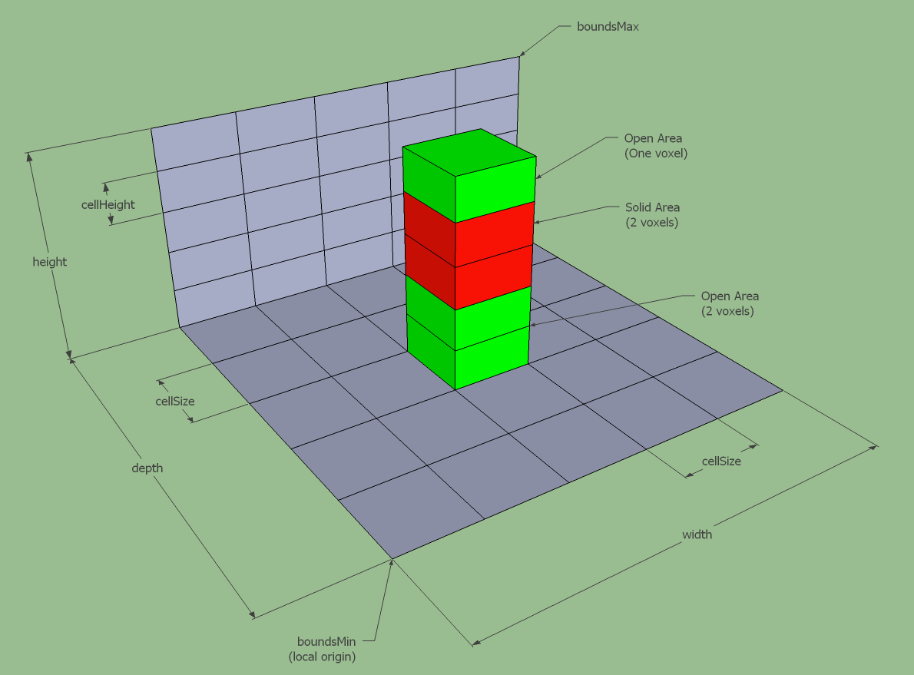
            
        * <b>solid heightfield</b> 构建过程
            * 几何体三角面标记
                > `::rcMarkWalkableTriangles()`

                计算三角面的normal，判断normal与X-Zaxis的角度是否在`walkableSlopeAngle`内:  
                > `normal[1] > walkableSlopeAngleCos => RC_WALKABLE_AREA`

            * 根据几何体信息生成高度场 —— 光栅化算法
                > `RecastRasterization.cpp`  
                > `::rcRasterizeTriangles()`  
                > `::rasterizeTri()`

                UE4 使用了与原始`Recast`库不同的光栅化算法
                > `Recast` 采用的是空间划分，用Z=CZ、Z=CZ + CS和X=CX、X=CX + CS，四个面来切割三角形得到一个Span空间列, 再通过Y轴上的裁剪得到正确的Span

                UE4采用的类似`Scan-Line的光栅化算法`, 核心思想是维护一个`rcRowExt数组`，这个数组表示的是, 对于体素化坐标系Z轴上的某个取值CZ, 相应三角面在X轴上覆盖的跨度，最后遍历这个数组则可以得到光栅化后的Span。下面是基于X-Z平面的具体做法  
                1. 三角面顶点信息转换到体素化坐标系下(体素化坐标系以高度场坐标为原点，Cell大小为基础单位)
                2. 遍历三角面的三个边，对于每个边逐X进行处理，放到`rcRowExt数组`中  
                    处理单边情况: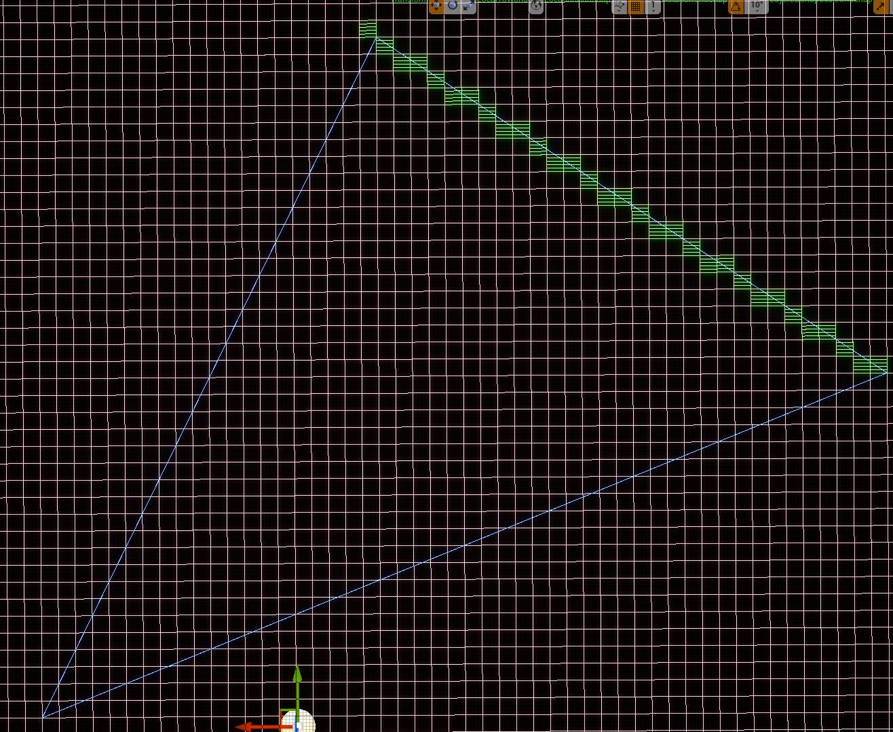
                    处理完三个边: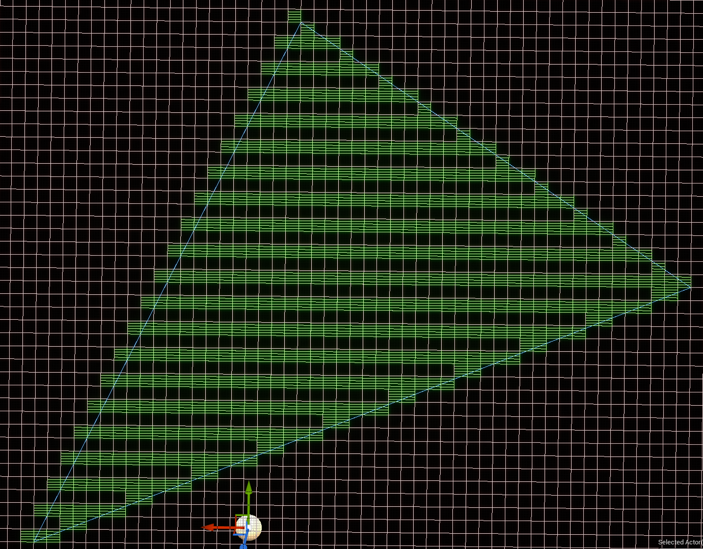
                    由于单边的遍历跨度是Cell长度，一些跨Cell的斜边会在这个遍历过程中得不到正确的记录,所以会出现上面的`空行问题`
                3. 处理上面的`空行问题`,对于三角面覆盖的每个Z-row，我们记录跨过这个Z-row的边的信息，存入`rcEdgeHit数组`中, 对于每个Z-row, 一定被两条边跨过，SpanZ-row这个两个边的X的范围，更新进`rcRowExt数组`
                    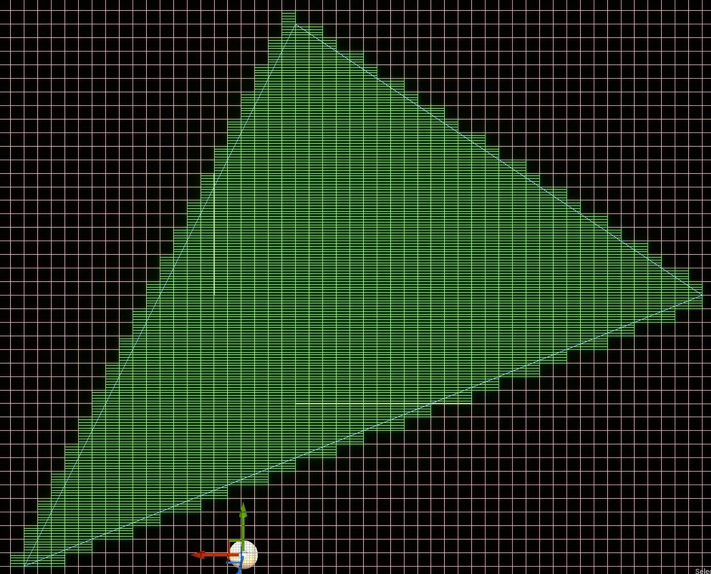
                4. 通过`rcRowExt数组`生成Span信息

            * `::rasterTri()`的流程图  
                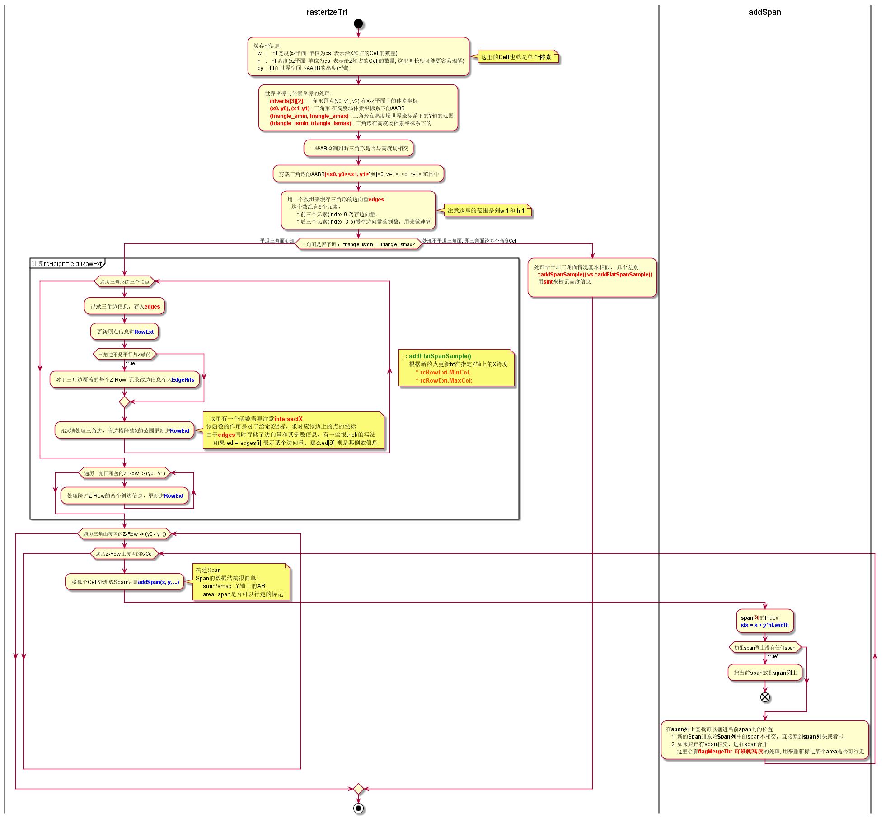

        * <b>Compact heightfield</b> 构建过程  
            这个构建过程很简单，分两步:
            1. `Solid heightfield`中每个`RC_WALKABLE_AREA`的Span上面都有一个`Compact heightfield`的Span
            2. 建立`Compact heightfield`中span的连接关系(四方向相邻关系)
    3. 距离场信息的构建
        距离场表示`Compact feightfield`中各个Span到边界(不可行走区域)的距离信息  
        > 核心代码:  
        > `::rcBuildDistanceField`  
        > `::dtBuildTileCacheDistanceField`  

        距离场是基于`Compact heightfield`生成的，基本构建算法:
        1. 标记边界区域，遍历高度场中所有Span， 如果Span某个方向不存在邻接Span， 或者邻接Span为不可行走区域，那么该Span为边界  
            该步骤之后得到的距离场信息如下：
                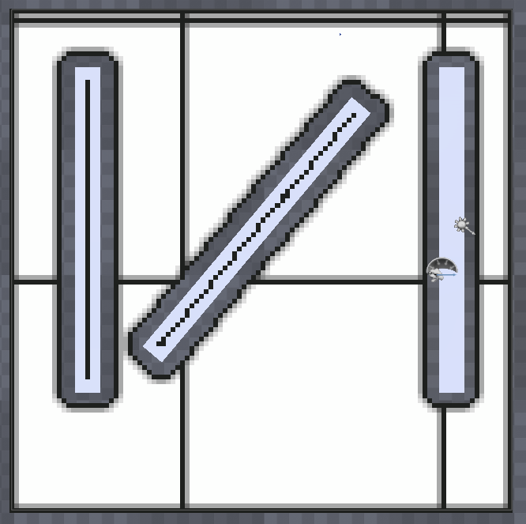
        2. 第一遍计算, 从下往上, 从左往右遍历所有Span，依次计算改Span的左邻Span，左下邻Span，下邻Span，下右邻Span，计算该Span到边界的距离  
            该步骤之后得到的距离场信息如下：
                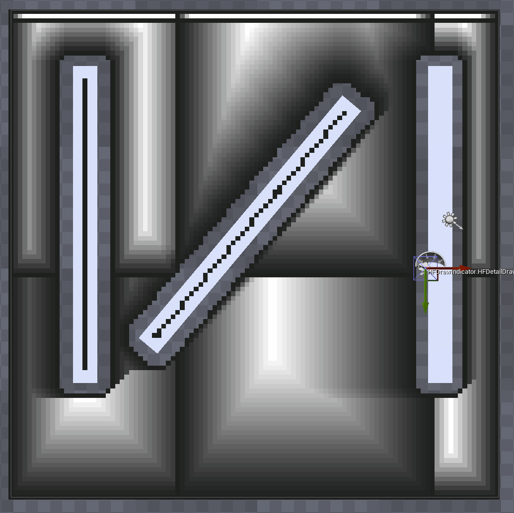
        3. 第一遍计算, 从上往下遍历, 从右往左遍历所有Span，依次计算改Span的右邻Span，右上邻Span，上邻Span，下左邻Span，计算该Span到边界的距离  
            该步骤之后得到的距离场信息如下：
                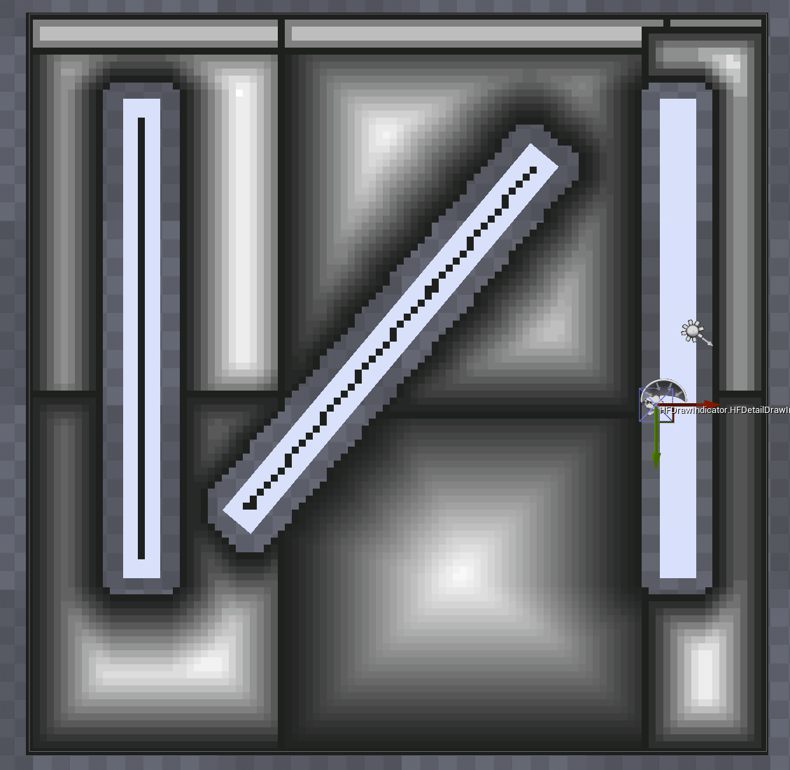
        4. blue过程, 遍历所有Span，与8方向上的距离做混合处理  
                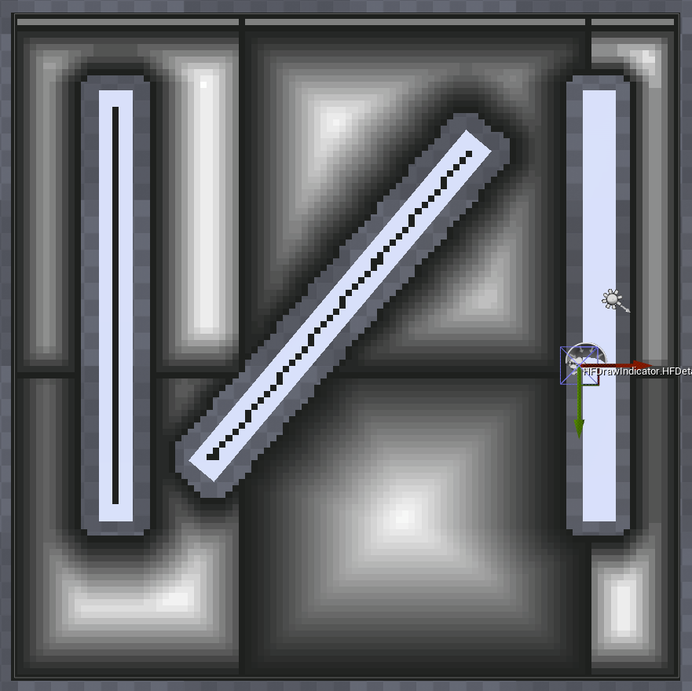
    4. 区域划分  
        根据距离场进行区域划分  
        * UE4提供3中区域划分的算法
            * `Monotone` 最快
            * `Watershed` 效果最好，区域最均匀
            * `Chunky Monotone` 介于上两种之间

        * UE4默认是`Watershed`算法，这里对这个算法进行分析
        `Watershed` —— 分水岭算法，用`水`的渗透深度来检测区域连通性。  
            > 可以将距离场中求得的Span到边界的`Distance`作为该`Span区域的深度`(MaxDistance 为Compact heighfield的深度最低点), 不断递增`水位`，通过判断当前水位是否淹过Span来构建Span的连通性
            算法简介

            1. 标记Tile的border区域, 将其作为单独`Region`处理
            2. 从`深度`最深处(`水位`)`MaxDistance`开始进行水位监测
            3. 收集在当前`深度`以下的所有Span放到缓存数组Stack中，循环遍历Stack, 如果Span的邻接Span已经有Region，那么将Span加入此Region。
            4. 遍历所有Span，如果存在在当前`深度`一下，并且没有得到正确分配Region的Span，新增Region来放这些Span
            5. 减少当前`深度`, 重复上面的过程进行探测

        * `::rcGatherRegionsNoFilter()`的流程图  
            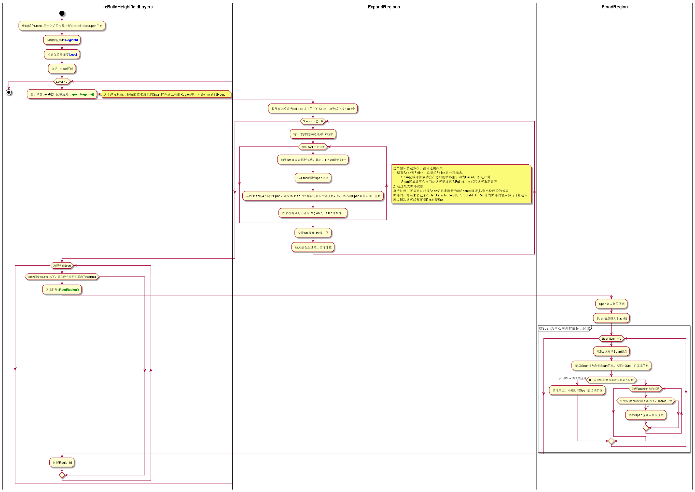

        * 区域合并
            * 生成`LayerRegion`
            * 构建区域连通性
                > `::walkContour`
                * 如果某个`Span`存在不同RegionId的邻`Span`,那么该`Span`处在区域边界上, 从该`Span`开始进行区域连通性的搜索
                * 对于目标Span, 先从其已经确定是不同Region的邻Span的方向顺时针搜索目标Span的邻Span
                * 如果邻Span是RegionId不同，则更新联通性信息, 继续顺时针找下一个邻Span
                * 如果邻Span处于相同RegionId, 则将该邻Span当作目标Span，且下一个搜索方向为逆时针方向
                * 重复上面步骤
                * 算法结束条件，搜索的目标Span与初始搜索Span相同，且搜索方向与初始搜索方向相同, 说明回到了初始搜索条件，推出循环

                 这个算法可能会导致死循环，最大循环次数为 `40000`
            * 移除过小的`Region`和`邻Region`  
                > `minRegionArea`  
                > `mergeRegionSize`
            * 收缩Layer Ids
    5. 生成区域轮廓
        > `::dtBuildTileCacheContours()`

        * 轮廓生成基本算法 -- "Walking the edge"
            * `edge` : 两个RegionId不同的Span的共同边
            * 沿着Span遍历Region所有的`edge`则可以得到区域的轮廓
        * 轮廓搜寻过程
            1. 从某个边界Span开始,先找到其一个不联通边, 并标记为轮廓  
                假定下图中`1`为开始Span  
                下方向为初始方向
                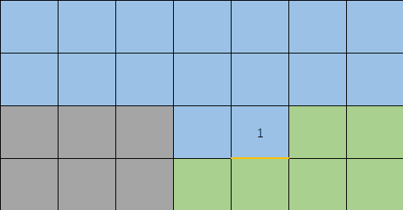
            2. 顺时针旋转查找方向，得到左方向 Span2
                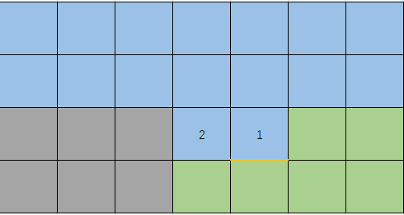
            3. Span2 为相同区域，则逆时针旋转查找方向进行探测，得到下方向, 为不连通边，标记为轮廓
                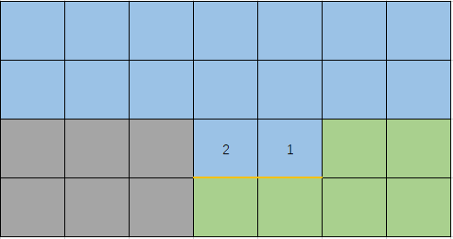
            4. 顺时针旋转查找方向，发现不连通边，标记为轮廓
                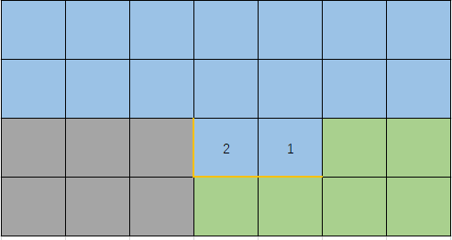
            5. 顺时针旋转查找方向，得到上方向Span3
                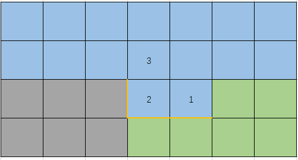
            6. Span3为同区域, 逆时针旋转查找方向，得到左方向, 发现左方向Span4
            7. 顺时针旋转方向，得到下方向，下方向为不连通边，标记为轮廓
                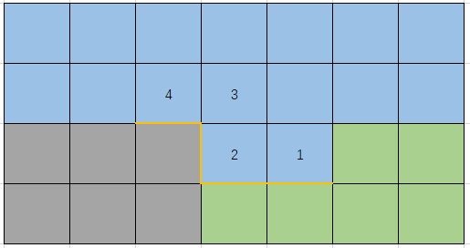
            8. 依次重复上述步骤
                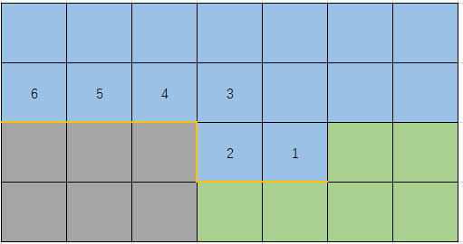
            9. 当查找回到起始点是，轮廓构建完毕
                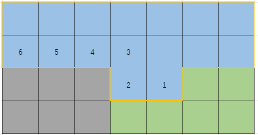
        * 轮廓简化
    6. 创建凸多边形网格
        将轮廓信息切割成凸多边形
        > `::dtBuildTileCachePolyMesh()`
        > `::triangulate()`
        
        基本过程涉及两个步骤, 首先将轮廓三角化，切割成多个三角形, 再将三角形进行合并，形成凸多边形

        * 三角化算法
            * 叉乘判断点与线的位置关系
            * 

    1. asda
 * 生成过程相关的时序图
       * 
* `FRecastTileGenerator::AddGeneratedTiles` & `FRecastTileGenerator::addTile`
    将`FRecastTileGenerator`生成的tile数据更新到dtNavMesh中  
    `FRecastTileGenerator::addTile`流程: 
    * 

## 寻路过程
### 1. 路径查找算法
  <code> dtNavMeshQuery::findPath() </code>  
  这个方法是一个很基础的A*算法  
  * 

### 2. 路径平滑算法 -- 简单漏斗算法（待补充）

### 2. UE4基于寻路的移动
  * 

## `NavigationSystem` 场景树管理和寻路信息维护
* 八叉树 `FNavigationOctree`
    * `FNavigationOctreeElement`
        * `FNavigationRelevantData`
    * 一个重要的接口 `INavRelevantInterface`
        * 两个接口实现类
            - <b><u>`UPrimitiveComponent`</u></b>
            - `ANavModifierVolume`
            - `ANavLinkProxy`
            - `UNavRelevantComponent`
        * `GetNavigationData`
* 寻路信息动态更新 
    * `FNavigationSystem::UpdateActorData` --> `UNavigationSystemV1::UpdateActorInNavOctree`
        * `ANavModifierVolume::RebuildNavigationData`
    * `FNavigationSystem::UpdateComponentData` --> `UNavigationSystemV1::UpdateComponentInNavOctree`  
        * `USceneComponent::UpdateNavigationData`

## `NavCollision`
 `NavCollision` 用来记录Geometry的信息(比如顶点等)
 * `::GatherCollision()`
 * `::ExportGeometry()`

## `Recast`解析
### 高度场信息
* `rcHeightField`
    > | 属性 | 类型 | 描述 | 
    > | :----: | :----: | :----: |
    > | width/height | int | 高度场二维长宽, 这里的<b>Height</b>并非三维空间的高度 |
    > | cs/ch | float | 体素大小 |
    > | spans | rcSpan* | <b> 高度场核心数据</b>, 数组，长度为 <b>width * height</b>|
    > | EdgeHit | rcEdgeHit* | <i>UE自定义数据</i> |
    > | RowExt | rcRowExt* | <i>UE自定义数据</i> |
    > | tempspans | rcTempSpan* | <i>UE自定义数据</i> |
* `rcHeightfieldLayer`
    > | 属性 | 类型 | 描述 | 
    > | :----: | :----: | :----: |
    > | cs/ch | float | 体素大小 |
    > | width | int | 高度场宽 |
    > | height | int | 高度场高 |
    > | heights | short* | 高度场数据 | 
    > | areas | char* | |
    > | cons | char* | |
### `Recast`函数解析
* `rcAllocHeightfield` 分配高度场对象内存
* `rcCreateHeightfield`  
    初始化`rcHeightfield`, 主要是为`spans`分配内存, 并不会填充数据
* `rcMarkWalkableTriangles`  
    仅仅做简单的三角面法线检测，满足`walkableSlopeAngle`的三角面都标记为`RC_WALKABLE_AREA(63)`
* `rcRasterizeTriangles`  
    构建高度场`Solid Spans`
* `rcGetHeightFieldSpanCount`  
    获取高度场中可行走span的个数
* `rcBuildCompactHeightfield`  
    由`solid-span`高度场构建`open span`高度场(ConpactHeightfield)
* `calculateDistanceField`  
    计算`CompctHF`中的open span到边界(最近的不可行走的span)的距离
    计算规则，如果邻接span有不可行走，距离为0
        其他的，到邻接span距离为2， 到斜span的距离是3